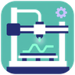

#  Kobra 2 Neo on Klipper

**Config backup for a heavily modified Anycubic Kobra 2 Neo: BTT Manta M8P, linear rails, sensorless homing, measured input shaping.**

---

Anycubic **Kobra 2 Neo**, heavily modified, running Klipper on a **BigTreeTech Manta M8P V2.0** (STM32H723, Debian 12 host). This repo is an automated backup of `~/printer_data/config`.

## Hardware

| Part | Detail |
|---|---|
| Board | BTT Manta M8P V2.0, TMC2209 ×5 (UART) |
| Motion | Linear rails on X and Y, GT2 6mm belts |
| Homing | Sensorless X/Y (StallGuard4), probe-based Z |
| Z axis | Dual independent motors (M3 + M4 drivers) with auto `Z_TILT_ADJUST` before every print — left: Creality 42-34, right: stock 42SHDC0059-18D |
| X/Y motors | 42SHDC0059-18D (stock Anycubic) |
| Extruder | Direct drive, 42BYGH0714-B-10HQ |
| Probe | Inductive, offset (24, 13.35) |
| Accelerometer | BTT ADXL345 (USB, RP2040) — plug in and enable `[include adxl345.cfg]` to measure |
| Usable volume | 220 × 220 × 200 mm |

## Tuning state (measured, not guessed)

- **Input shaper** (ADXL-measured after rail install): X `3hump_ei @ 105.2 Hz`, Y `ei @ 54.8 Hz` → accel budgets ~7500 / ~5500 mm/s²
- **Sensorless homing**: 20 mm/s single-touch, `SGTHRS` X 58 / Y 64
- **TMC autotune** with custom `motor_constants` for the unlabeled Anycubic motors — coil resistance derived from the drivers' own StealthChop auto-calibration registers (`PWM_AUTO`), validated against the known Creality 42-34
- Slicer (OrcaSlicer) machine limits mirror the measured shaper budgets

## Notable config

- `printer.cfg` — main config; `SAVE_CONFIG` block carries measured shaper + probe values
- `macros.cfg` — [jschuh/klipper-macros](https://github.com/jschuh/klipper-macros) wrapper: sensorless homing override (reduced current, probe-over-bed-center Z homing), start-print phases with z-tilt + adaptive mesh
- `adxl345.cfg` — resonance test setup (include commented out unless the sensor is plugged in)

## Backups

Pushed automatically by [Klipper-Backup](https://github.com/Staubgeborener/Klipper-Backup) (filewatch service) whenever a config file changes.
